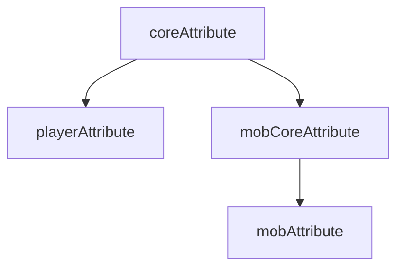

# ShardLib

ステータスを持ったプレイヤー、アイテム、エンティティが必要なシステムに使用できます。

> [!IMPORTANT]
> このシステムは、内部的にステータスを持たせることしかできません。
> 見た目などは別途作成が必要になります。

## ステータスの定義システムの詳細

- ステータスは、上位と下位があり、上位で定義されたものは下位に引き継がれます。
- 下位では上位で定義されたステータスを上書きできます。

ステータスの関係については以下の図を参照

> ファイルの位置は以下から続きます  
> plugins/ShardLib/...

| ステータスの定義         | そのファイルのコンフィグでの位置   | 定義の説明         |
|------------------|--------------------|---------------|
| coreAttribute    | attribute/*        | 全ての根幹となるステータス |
| playerAttribute  | player/attribute/* | プレイヤーのステータス   |
| mobCoreAttribute | mob/attribute/*    | モブの根幹ステータス    |
| mobAttribute     | mob/profile/定義ファイル | 実際のモブステータス    |

`*` はそのディレクトリにあるすべてのファイルを表します  
